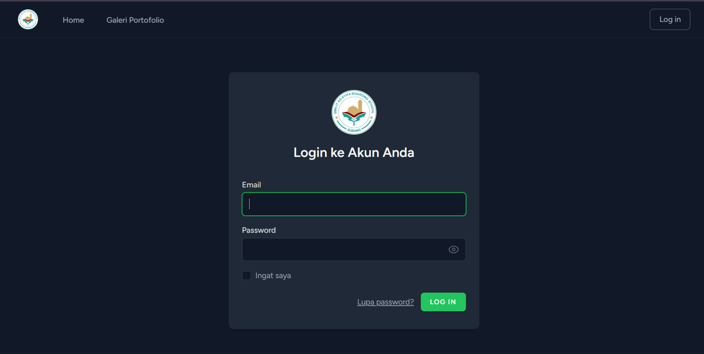
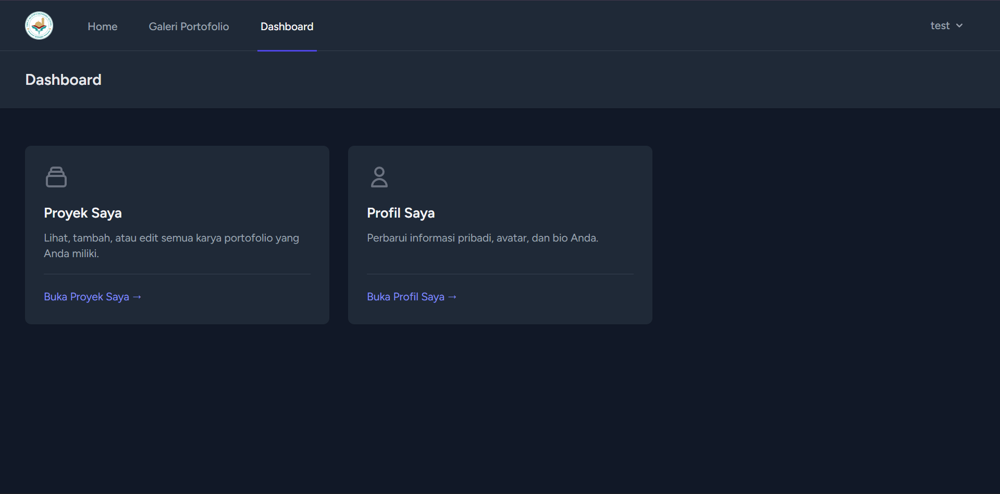
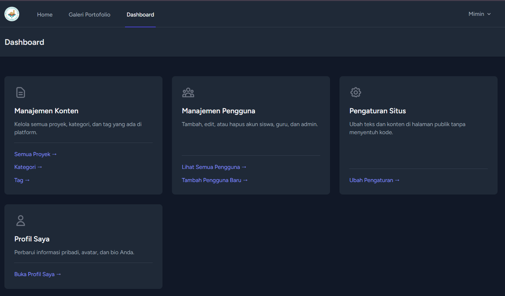
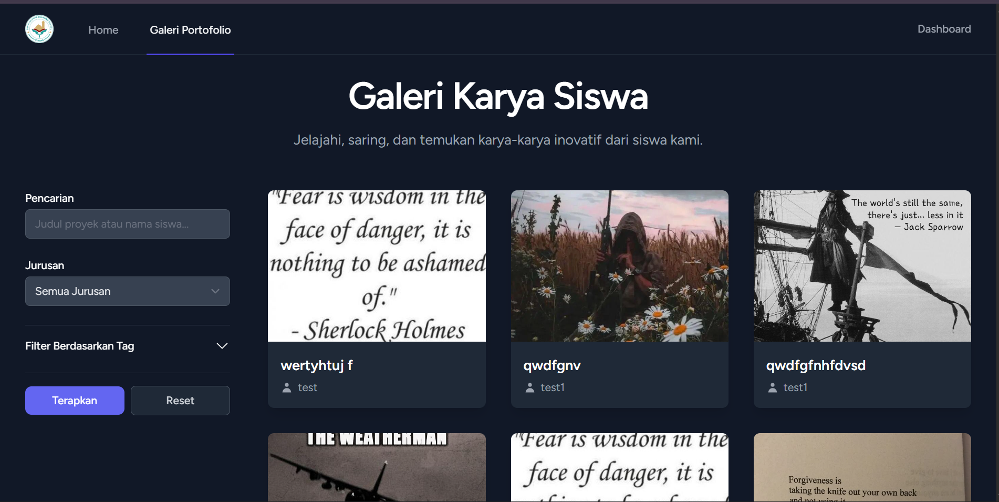

# Sistem Manajemen Portofolio Siswa (SMK-IT Portofolio)

Sistem Manajemen Portofolio Siswa adalah aplikasi web yang dibangun untuk memungkinkan siswa di lingkungan sekolah (khususnya SMK) untuk mengunggah, mengelola, dan memamerkan proyek atau karya mereka. Aplikasi ini juga memiliki panel admin untuk guru atau administrator untuk meninjau, menyetujui, atau menolak proyek yang dikirimkan.

## Tampilan Aplikasi (Screenshot)

*Sisipkan gambar-gambar terbaik dari aplikasimu di sini. Kita akan lakukan ini setelah kamu selesai dengan teksnya.*

_Halaman Login_


_Dashboard Siswa_


_Dashboard Admin_


_Tampilan Galeri Karya Siswa_



## Fitur Utama

- **Otentikasi Pengguna:** Sistem login dan register dengan peran yang berbeda (Siswa, Guru/Admin).
- **Manajemen Proyek (CRUD):** Siswa dapat membuat, membaca, memperbarui, dan menghapus proyek mereka.
- **Upload Media:** Siswa dapat mengunggah gambar dan menautkan video YouTube untuk setiap proyek.
- **Sistem Review & Persetujuan:** Admin dapat meninjau proyek yang masuk dan mengubah statusnya (Disetujui, Ditolak, Menunggu Tinjauan).
- **Notifikasi Email:** Siswa menerima notifikasi email otomatis ketika status proyek mereka diperbarui oleh admin.
- **Kategorisasi & Tagging:** Proyek dapat diatur dengan kategori dan tag untuk memudahkan pencarian dan penyaringan.
- **Panel Admin:** Dashboard khusus untuk admin mengelola pengguna, proyek, kategori, dan tag.
- **Profil Pengguna:** Setiap siswa memiliki halaman profil publik yang menampilkan semua proyek mereka yang telah disetujui.

## Teknologi yang Digunakan

- **Back-End:**
  - PHP 8+
  - Laravel 11
  - MySQL
- **Front-End:**
  - Blade (Template Engine Laravel)
  - Tailwind CSS
  - Alpine.js (untuk interaktivitas ringan)
- **Lainnya:**
  - Composer (Manajemen dependensi PHP)
  - Vite (Build tool untuk aset front-end)

## Cara Menjalankan Proyek Secara Lokal

Untuk menjalankan proyek ini di lingkungan pengembangan lokal, ikuti langkah-langkah berikut:

1.  **Clone repositori ini:**
    ```bash
    git clone [https://github.com/clownface471/smkit-portofolio.git](https://github.com/clownface471/smkit-portofolio.git)
    cd smkit-portofolio
    ```

2.  **Install dependensi Composer:**
    ```bash
    composer install
    ```

3.  **Buat salinan file `.env`:**
    ```bash
    cp .env.example .env
    ```

4.  **Generate a new application key:**
    ```bash
    php artisan key:generate
    ```

5.  **Konfigurasi database Anda di file `.env`:**
    ```
    DB_CONNECTION=mysql
    DB_HOST=127.0.0.1
    DB_PORT=3306
    DB_DATABASE=nama_database_anda
    DB_USERNAME=user_database_anda
    DB_PASSWORD=password_database_anda
    ```

6.  **Jalankan migrasi database dan seeder (jika ada):**
    ```bash
    php artisan migrate --seed
    ```

7.  **Install dependensi NPM dan build aset front-end:**
    ```bash
    npm install
    npm run dev
    ```

8.  **Jalankan server pengembangan:**
    ```bash
    php artisan serve
    ```

Aplikasi sekarang akan berjalan di `http://127.0.0.1:8000`.